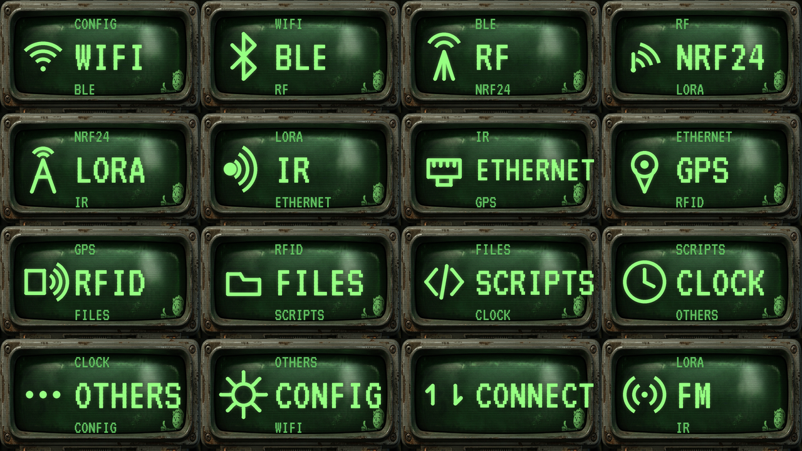

# ☢️ Fallout Pip-Boy — Bruce Theme

  

> **EN** — A **Fallout Pip-Boy** UI theme for the **[Bruce firmware](https://github.com/BruceDevices/firmware)** on the LilyGO T-Embed CC1101 (320×170). Rusty metal bezel, phosphor-green CRT, Vault-Boy in the corner. Each menu entry shows a green picto on the left and a **VT323 terminal** stack on the right: previous item (small), current item (large), next item (small).

> **FR** — Un thème UI **Fallout Pip-Boy** pour le firmware **[Bruce](https://github.com/BruceDevices/firmware)** sur LilyGO T-Embed CC1101 (320×170). Cadre métal rouillé, CRT vert phosphore, Vault Boy dans le coin. Chaque entrée affiche un picto vert à gauche et une pile **terminal VT323** à droite : menu précédent (petit), courant (grand), suivant (petit).

## 🎮 Rendu / Look

Le libellé du menu est **intégré dans l'image** (`label: 0`), façon terminal Pip-Boy :

- 🟢 **Picto vert** de l'entrée courante à gauche (halo phosphore + scanlines CRT).
- 🔠 À droite, de haut en bas : **précédent** (petite police) · **COURANT** (très grande) · **suivant** (petite police).
- ⚙️ 14 pictos dessinés à la main : WiFi, BLE, RF, NRF24, LoRa, IR, Ethernet, GPS, RFID, Files, Scripts, Clock, Others, Config (+ FM & Connect).

## 📦 Contenu

`Fallout_PipBoy/` contient **4 tailles** (une par gabarit d'écran Bruce), chacune avec **16 PNG** + son `.json` :

| Dossier | Résolution | Cible typique |
|---|---|---|
| `105px/` | 240×105 | M5StickC Plus |
| `140px/` | 320×140 | écrans 320×140 |
| `180px/` | 320×180 | **T-Embed CC1101 / Cardputer** |
| `192px/` | 320×192 | écrans 320×192 |

## 🚀 Installation

1. Copie le dossier **`Fallout_PipBoy`** à la racine de la carte SD.
2. Sur l'appareil : **Config → UI Theme → `Fallout_PipBoy/<taille>/Theme_Fallout_PipBoy.json`** (prends la taille de ton écran, `180px` pour le T-Embed CC1101).
3. Via WiFi : **Files → WebUI**, upload le dossier, puis sélectionne le `.json`.

## ⚠️ Ordre du menu (voisins)

Les libellés **précédent / suivant** sont peints dans chaque image selon l'**ordre par défaut** du menu Bruce T-Embed CC1101 :
`WiFi → BLE → RF → NRF24 → LoRa → IR → Ethernet → GPS → RFID → Files → Scripts → Clock → Others → Config` (en boucle).

Si tu **désactives ou réordonnes** des menus (`Config → Main Menu`), les voisins affichés ne correspondront plus. Dans ce cas, ouvre une issue avec ton ordre exact et je régénère le thème pour ta config.

## 🛒 Matériel / Hardware

Le matériel utilisé pour ce projet — liens affiliés Amazon :

|  |  |  |
|:---:|:---:|:---:|
| 🔌 **[LilyGO T-Embed CC1101](https://link.amazon/B0cgD7wou)** avec antennes | ⬛ **[LilyGO T-Embed CC1101](https://link.amazon/B071fmsbH)** noir, sans antenne | 📡 **[Kit d'antennes SMA](https://link.amazon/B0eMlSqeZ)** |

En tant que Partenaire Amazon, je réalise un bénéfice sur les achats remplissant les conditions requises. · As an Amazon Associate I earn from qualifying purchases.

## 🎨 Crédits

- Fond Pip-Boy & thème par **koua29**.
- Police de rendu : **[VT323](https://fonts.google.com/specimen/VT323)** (SIL Open Font License).
- Tourne sur l'excellent **[Bruce firmware](https://github.com/BruceDevices/firmware)**.

## ☕ Un café ?

Si ce thème te plaît :

## 📄 Licence

**MIT** — voir [LICENSE](LICENSE). Fallout / Pip-Boy / Vault Boy sont des marques de Bethesda ; ce thème est un projet fan non officiel, non affilié.
